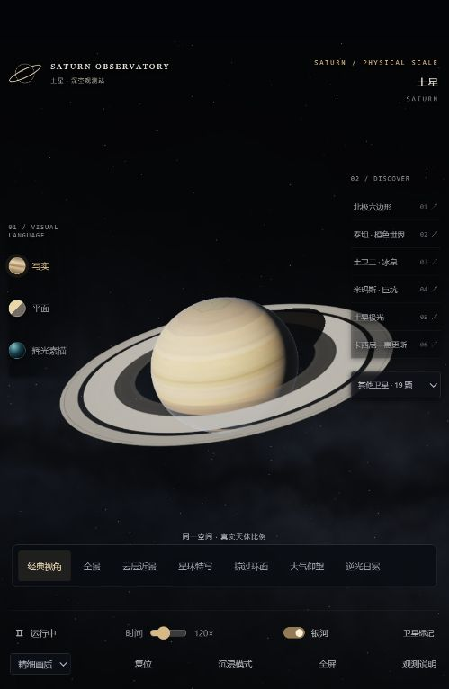
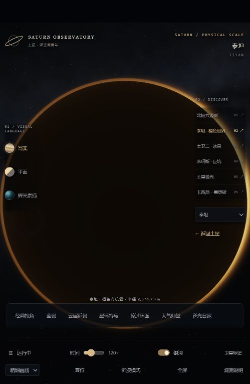

# 土星观测站 · Saturn Observatory

[在线体验](https://rurushi-mo.github.io/saturn-observatory/) · [下载离线 HTML](https://github.com/Rurushi-mo/saturn-observatory/raw/refs/heads/main/index.html) · [历史版本](archive/README.md)

基于 Three.js / WebGL 的交互式三维土星观测网页。围绕同一空间中的土星、星环、19 颗主要卫星与卡西尼探测器，平滑切换观测位置。



## 打开与分享

直接用 Edge 或 Chrome 打开根目录 **index.html**，无需安装依赖、联网或解压。模型、纹理和运行库已内嵌，网页约 7.4 MB。需要浏览器启用 WebGL；高画质较依赖 GPU，较慢设备可选择“标准画质”。

也可启用 GitHub Pages，让访客通过 HTTPS 链接访问。具体步骤见 [发布说明](docs/PUBLISHING.md)。仓库代码页本身不会运行 HTML，分享体验时请使用 Pages 地址。

## 内容与操作

- 三种画风：写实、平面、辉光素描。
- 经典、全景、云层近景、冰粒特写、掠过环面、大气仰望、逆光日冕。
- 北极六边形、泰坦、土卫二喷流、米玛斯、极光和卡西尼，以及其他卫星入口。
- 拖动环绕，滚轮缩放，双击复位；H 隐藏菜单，Esc 恢复菜单。
- 卫星和探测器可自由环绕，距离有安全边界；大气视角围绕当地竖直方向，近景有角度限制。
- 银河、卫星标记可开关；接近星环时出现结构标注。



## 科学数据与表现范围

这是科普与视觉探索项目，并非任务规划或精密星历模拟器。
土星尺度、主环半径及天体尺寸参考公开资料；19 颗卫星与卡西尼使用 JPL Horizons 的 **2004-07-01 02:39 UTC** 位置快照。
时间控制云层自转、环粒差速和气体现象，不推进卫星与探测器星历。太阳采用构图照明方向，未与该历史历元对齐。
云形、银河、局部冰粒、部分小卫星表面和大气散射为可视化近似；探测器姿态未重建历史遥测。
本项目由 AI 辅助开发，未经 NASA/JPL 审核或背书。资料来源与素材加工记录见 [第三方说明](THIRD_PARTY_NOTICES.md)。

## 开发与验证

使用 Node.js 22 或更新版本。在项目根目录运行：

```sh
npm ci
npm test
npm run build
npm run verify
npm run preview
```

本地预览默认地址为 http://127.0.0.1:8766/ 。`npm ci` 首次需要网络；之后使用现有依赖构建无需下载素材。
`npm run build` 只生成根目录 index.html，不改动历史档案。已有网页可直接使用，不需要构建。
镜头检查覆盖 196 组转换、障碍物避让、端点连续性、圆锥边界、米级目标接近与中途改选。

## 文件结构

```text
index.html                 最新离线网页 / Pages 入口
src/                       可编辑程序、导航算法、界面模板
scripts/                   构建、完整性检查、本地预览
tests/                     镜头回归检查
assets/                    内嵌素材、星历、来源清单
archive/                   原有全部文件及 SHA-256 清单
docs/                      截图、发布说明、检测记录
licenses/                  第三方软件许可原文
```

历史版本见 [版本档案](archive/README.md)，更新内容见 [CHANGELOG](CHANGELOG.md)。

## 许可

本项目原创代码按 [MIT License](LICENSE) 发布；该许可允许他人在保留声明的前提下使用、修改和分发，包括商业使用。
NASA/JPL 模型、纹理、数据和第三方软件仍按 [各自条件](THIRD_PARTY_NOTICES.md) 使用，不因本仓库的 MIT 许可改变。
