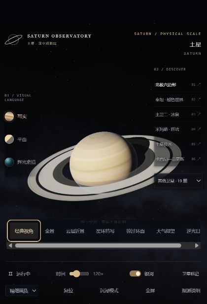
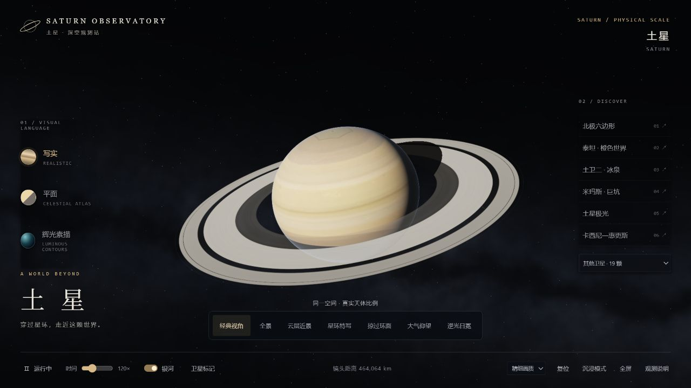

# 公开提交前检测记录

日期：2026-09-29。检测对象：整理后的 3.0.0 发布目录。

| 检查 | 结果 |
| --- | --- |
| 锁定依赖安装 | `npm ci --ignore-scripts` 成功安装 Three.js 0.180.0 与 esbuild 0.25.10 等 3 个包 |
| 构建 | `node scripts/build.mjs` 成功；重复构建得到相同 SHA-256 |
| 导航基础 | 5 组路线、10,005 个采样点通过；无遮挡直达、避让、圆锥边界、米级接近通过 |
| 镜头组合 | 196 组转换、19,796 个采样点通过；起点误差 0，最大终点误差约 9.32e-10 km |
| 中途改选 | 8 次通过；最大位置跳变 0，角度误差约 4.22e-8 rad |
| 历史文件 | 原有全部 7 个文件与整理前 SHA-256 一致；v2 的两份原文件内容相同 |
| 运行依赖 | index.html 的模型、贴图与运行库内嵌，未引用外部运行素材 |
| 素材一致性 | HTML 内嵌数据与 assets/embedded.json 一致；星历与 assets/ephemeris.json 一致 |
| 核心程序 | src/main.js 与 src/navigation.js 与原第三版逐字节一致 |
| 发布材料 | README 相对链接有效；来源清单、许可全文、历史清单、.nojekyll 与忽略规则齐全 |
| Git 属性 | 历史快照与生成的 HTML 不转换换行；这两类文件保留原始/第三方空白，其余文本使用 LF |
| 隐私检查 | 待发布文本中未检出个人用户目录、常见 GitHub 凭据或私钥标记；未包含聊天截图、缓存、.env 或 node_modules |
| 浏览器抽查 | 本机浏览器正常显示首页、北极/泰坦场景和观测说明；通过键盘激活观测按钮；检查时控制台未发现错误或警告 |

页面文件：7,367,995 字节。

```text
SHA-256(index.html)
cc9c26c95868685658535310552de2ee18c5b16a9618e71468f39ddfb67f3f12
```

本次验证在 Windows / Node.js 24.15.0 和本机 Chromium 浏览器环境中完成。未进行所有设备、浏览器和 GPU 的兼容性覆盖；GPU 较弱的设备应降低画质。
自动检查不等于全面安全审计。历史快照保持原样，不将最新版回归结果套用于历史版本。
上述表格记录本地提交前检测。项目所有者随后确认公开提交、MIT 许可和 Pages 发布，公网结果见下节。




## 公网发布复核 — 2026-09-29

- 公开仓库：https://github.com/Rurushi-mo/saturn-observatory
- HTTPS 网页：https://rurushi-mo.github.io/saturn-observatory/
- 初始发布提交：9723cf391a8411742c16918b595a19434ece0157，已创建 v3.0.0 标签。
- 首次 Pages 部署成功：https://github.com/Rurushi-mo/saturn-observatory/actions/runs/36523543871
- 公网页面返回 HTTP 200，Content-Type 为 text/html; charset=utf-8，HTTPS 强制开启。
- 下载的 HTML 与本地 index.html 逐字节一致，SHA-256 与本报告所列一致。
- 远端 archive/manifest.json 与本地历史档案清单一致。
- 浏览器实际打开 HTTPS 页面，土星和菜单正常显示，检查时控制台未发现错误或警告。
- 本节与公开页面截图属于发布后文档更新，未修改网页程序或历史文件。


